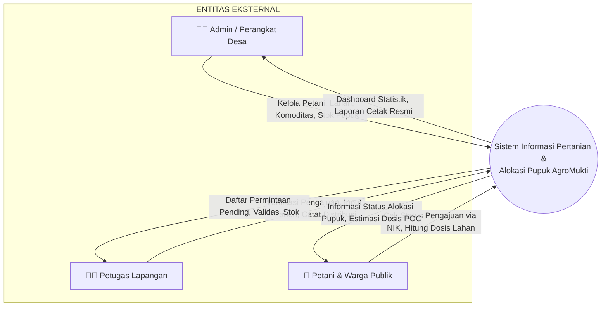
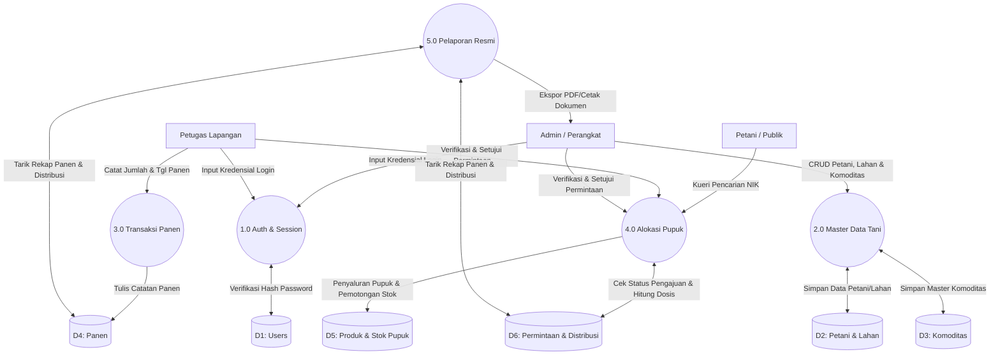
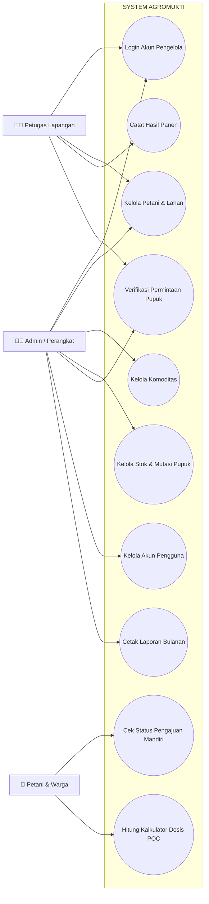

# SPESIFIKASI PERANCANGAN SISTEM (SYSTEM DESIGN SPECIFICATION)
## Sistem Informasi Pertanian & Alokasi Pupuk Organik (AgroMukti)
**Desa Argamukti, Kecamatan Argapura, Kabupaten Majalengka**  
*Mitra KKM UMC 2026 – Ayu Rianti (NIM: 230511037)*

---

## 📋 DAFTAR ISI DOKUMEN
1. [Diagram Konteks (DFD Level 0)](#1-diagram-konteks-dfd-level-0)
2. [Data Flow Diagram (DFD Level 1)](#2-data-flow-diagram-dfd-level-1)
3. [Use Case Diagram (UML)](#3-use-case-diagram-uml)
4. [Flowchart Utama Aplikasi](#4-flowchart-utama-aplikasi)
   - [Flowchart 4.1: Otentikasi Pengelola & Hak Akses (RBAC)](#flowchart-41-otentikasi-pengelola--hak-akses-rbac)
   - [Flowchart 4.2: Alur Siklus Permintaan & Penyaluran Pupuk](#flowchart-42-alur-siklus-permintaan--penyaluran-pupuk)
   - [Flowchart 4.3: Alur Pencatatan Hasil Panen Sayur](#flowchart-43-alur-pencatatan-hasil-panen-sayur)
5. [Kamus Data & Struktur Database (12 Tabel Utama)](#5-kamus-data--struktur-database-12-tabel-utama)
6. [Arsitektur Deployment Online Web Hosting](#6-arsitektur-deployment-online-web-hosting)
7. [Integrasi Ekonomi Sirkular Lintas Sistem Desa](#7-integrasi-ekonomi-sirkular-lintas-sistem-desa)

---

## 1. Diagram Konteks (DFD Level 0)

Diagram Konteks menggambarkan batasan luar sistem AgroMukti dan bagaimana data ditukarkan antara entitas eksternal (Admin, Petugas, Petani/Masyarakat) dengan inti sistem AgroMukti.



---

## 2. Data Flow Diagram (DFD Level 1)

DFD Level 1 memecah sistem AgroMukti menjadi 5 proses bisnis utama dan menunjukkan ke penyimpanan data (*datastores*) mana data tersebut disimpan.



---

## 3. Use Case Diagram (UML)

Use Case Diagram mendefinisikan fungsionalitas yang dapat dijalankan oleh masing-masing Aktor (Admin, Petugas, dan Petani/Publik).



---

## 4. Flowchart Utama Aplikasi

### Flowchart 4.1: Otentikasi Pengelola & Hak Akses (RBAC)
Mekanisme pengamanan hak akses pada backend PHP Native menggunakan Session untuk menjaga agar hanya pengguna sah (`admin` atau `petugas`) yang dapat memodifikasi data.

```
       [ MULAI: Beranda Utama index.php ]
                       │
                       ▼
       [ Klik Menu Login / Masuk Panel ]
                       │
                       ▼
            [ Halaman login.php ]
                       │
                       ▼
         [ Input Username & Password ]
                       │
                       ▼
         / Cek username di tabel users \
        <   Valid & Password Hash Cocok? >
         \                              /
          └────────────┬───────────────┘
             TIDAK     │     YA
       ┌───────────────┘     └───────────────┐
       ▼                                     ▼
 [ Tampilkan Alert Error ]            [ Set Session: ]
 [ Tetap di Halaman Login ]           [ user_id, nama, role ]
                                             │
                                             ▼
                                 [ Alihkan ke dashboard.php ]
                                             │
                                   ┌─────────┴─────────┐
                                   ▼                   ▼
                              (Role: Admin)     (Role: Petugas)
                              - Akses Full CRUD   - Akses CRUD Data
                              - Kelola Akun       - Verifikasi Salur
                                   │                   │
                                   └─────────┬─────────┘
                                             ▼
                                          [ Selesai ]
```

---

### Flowchart 4.2: Alur Siklus Permintaan & Penyaluran Pupuk
Mekanisme validasi stok pupuk ketika petugas menyetujui permintaan pupuk dari kelompok tani.

```
          [ MULAI: Pengajuan Permintaan Pupuk ]
                            │
                            ▼
           [ Admin/Petugas input Permintaan ]
           [ (Petani, Produk Pupuk, Jumlah) ]
                            │
                            ▼
          [ Simpan ke DB status: 'diajukan' ]
                            │
                            ▼
          [ Petugas buka permohonan di Panel ]
                            │
                            ▼
            / Putusan Evaluasi Permintaan \
           <      Disetujui atau Ditolak?  >
            \                             /
             └──────┬──────────────┬─────┘
             DITOLAK│              │DISETUJUI
                    ▼              ▼
           [ Update status ]   / Cek Stok Pupuk di stok_pupuk \
           [ 'ditolak'     ]  <        Apakah Stok >= Jumlah?   >
                    │          \                               /
                    │           └───────┬──────────────┬──────┘
                    │              TIDAK│              │YA
                    │                   ▼              ▼
                    │           [ Gagal: Stok   ]  [ Update status 'disetujui' ]
                    │           [ Kurang / Habis]  [ Buat Kode Distribusi      ]
                    │                   │          [ Kurangi stok di stok_pupuk]
                    │                   │          [ Catat Mutasi: 'keluar'    ]
                    └───────────────────┼──────────┘
                                        ▼
                                    [ Selesai ]
```

---

### Flowchart 4.3: Alur Pencatatan Hasil Panen Sayur
Bagaimana petugas mencatat produktivitas hasil panen sayuran per musim tanam.

```
       [ MULAI: Input Hasil Tanam / Panen ]
                        │
                        ▼
            [ Akses halaman panen.php ]
                        │
                        ▼
             [ Klik '+ Catat Panen' ]
                        │
                        ▼
       [ Input Form: Tgl, Petani, Komoditas, Kg ]
                        │
                        ▼
         / Validasi kelengkapan isian form \
        <       Apakah semua field terisi?  >
         \                                 /
          └────────────┬──────────────┬───┘
               TIDAK   │              │YA
       ┌───────────────┘              └────────────────┐
       ▼                                               ▼
 [ Tampilkan Alert Error ]                 [ Simpan ke tabel panen ]
 [ Input Ulang ]                                       │
                                                       ▼
                                           [ Tampil di Datatable ]
                                           [ Grafik Dashboard terupdate ]
                                                       │
                                                       ▼
                                                   [ Selesai ]
```

---

## 5. Kamus Data & Struktur Database (12 Tabel Utama)

Basis data `db_argamukti` dirancang menggunakan MySQL/MariaDB dengan mesin penyimpanan InnoDB untuk mendukung integritas data referensial melalui Foreign Keys.

### 5.1 Tabel Master Pengguna (`users`)
Menyimpan akun kredensial akses admin dan petugas.
- `id` (INT, Primary Key, Auto Increment)
- `nama` (VARCHAR 100) - Nama lengkap pengguna
- `username` (VARCHAR 50, Unique) - Nama pengguna untuk masuk
- `password` (VARCHAR 255) - Password (terenkripsi menggunakan bcrypt)
- `role` (ENUM: 'admin', 'petugas') - Peran/hak akses

### 5.2 Tabel Master Petani (`petani`)
Menyimpan biodata diri petani Desa Argamukti.
- `id` (INT, Primary Key, Auto Increment)
- `nama` (VARCHAR 100) - Nama lengkap petani
- `nik` (VARCHAR 20, Unique) - NIK KTP (digunakan untuk verifikasi & cek status)
- `alamat` (TEXT) - Alamat dusun/RT/RW
- `no_hp` (VARCHAR 20) - Nomor kontak WhatsApp
- `status` (ENUM: 'aktif', 'nonaktif') - Status kepesertaan tani

### 5.3 Tabel Master Komoditas (`komoditas`)
Menyimpan daftar tanaman sayuran hortikultura lereng Ciremai.
- `id` (INT, Primary Key, Auto Increment)
- `nama` (VARCHAR 100) - Nama sayuran (misal: Bawang Daun, Tomat, Kentang)
- `deskripsi` (TEXT) - Penjelasan singkat atau panduan SOP tanam
- `status` (ENUM: 'aktif', 'nonaktif') - Status komoditas

### 5.4 Tabel Lahan Pertanian (`lahan`)
Menyimpan pemetaan luas tanah garapan per petani.
- `id` (INT, Primary Key, Auto Increment)
- `petani_id` (INT, Foreign Key -> `petani.id`)
- `komoditas_id` (INT, Foreign Key -> `komoditas.id`)
- `luas` (DECIMAL 12,2) - Luas lahan
- `satuan` (VARCHAR 20) - Unit luas (default: 'm2')
- `lokasi` (TEXT) - Nama blok lahan (misal: Blok Apuy Atas)
- `status` (ENUM: 'aktif', 'nonaktif') - Status keaktifan lahan

### 5.5 Tabel Hasil Panen (`panen`)
Menyimpan rekapitulasi produktivitas panen per siklus tanam.
- `id` (INT, Primary Key, Auto Increment)
- `petani_id` (INT, Foreign Key -> `petani.id`)
- `komoditas_id` (INT, Foreign Key -> `komoditas.id`)
- `jumlah_panen` (DECIMAL 12,2) - Kuantitas panen dalam Kg
- `tanggal_panen` (DATE) - Waktu pelaksanaan panen
- `keterangan` (TEXT) - Catatan tambahan

### 5.6 Tabel Master Produk Pupuk (`produk_pupuk`)
Menyimpan katalog jenis pupuk organik desa.
- `id` (INT, Primary Key, Auto Increment)
- `nama_produk` (VARCHAR 100) - Nama pupuk (kompos / POC cair)
- `jenis` (ENUM: 'kompos', 'pupuk_organik') - Kategori wujud pupuk
- `deskripsi` (TEXT) - Deskripsi produk
- `harga` (DECIMAL 12,2) - Nilai kontribusi pupuk (Rp) per satuan
- `satuan` (VARCHAR 20) - Unit (default: 'kg' atau 'liter')
- `foto` (VARCHAR 255) - File gambar produk
- `status` (ENUM: 'aktif', 'nonaktif') - Status produk

### 5.7 Tabel Stok Pupuk (`stok_pupuk`)
Menyimpan kuantitas fisik pupuk organik yang siap didistribusikan.
- `id` (INT, Primary Key, Auto Increment)
- `produk_pupuk_id` (INT, Foreign Key -> `produk_pupuk.id`)
- `jumlah` (DECIMAL 12,2) - Sisa stok saat ini
- `satuan` (VARCHAR 20) - Satuan berat/volume
- `updated_at` (TIMESTAMP) - Waktu pemutakhiran data terakhir

### 5.8 Tabel Mutasi Stok (`mutasi_stok`)
Mencatat log riwayat keluar/masuk pupuk di gudang secara auditabel.
- `id` (INT, Primary Key, Auto Increment)
- `produk_pupuk_id` (INT, Foreign Key -> `produk_pupuk.id`)
- `jenis_mutasi` (ENUM: 'masuk', 'keluar', 'penyesuaian') - Arah aliran stok
- `jumlah` (DECIMAL 12,2) - Volume mutasi
- `sumber` (VARCHAR 100) - Keterangan asal (Contoh: "Hasil Daur Ulang Bank Sampah" atau "Penyaluran REQ-001")
- `reference_id` (INT, Nullable) - ID referensi transaksi terkait
- `tanggal` (DATE) - Tanggal pencatatan
- `keterangan` (TEXT) - Alasan penyesuaian/catatan

### 5.9 Tabel Permintaan Pupuk (`permintaan_pupuk`)
Pencatatan pengajuan pupuk dari petani.
- `id` (INT, Primary Key, Auto Increment)
- `kode_permintaan` (VARCHAR 50, Unique) - Nomor invoice otomatis
- `petani_id` (INT, Foreign Key -> `petani.id`)
- `tanggal` (DATE) - Tanggal pengajuan
- `status` (ENUM: 'diajukan', 'diproses', 'disetujui', 'ditolak', 'selesai')
- `keterangan` (TEXT) - Catatan permohonan

### 5.10 Tabel Detail Permintaan (`detail_permintaan_pupuk`)
Daftar pupuk beserta kuantitasnya yang diminta dalam satu berkas pengajuan.
- `id` (INT, Primary Key, Auto Increment)
- `permintaan_id` (INT, Foreign Key -> `permintaan_pupuk.id` ON DELETE CASCADE)
- `produk_pupuk_id` (INT, Foreign Key -> `produk_pupuk.id`)
- `jumlah` (DECIMAL 12,2) - Kuantitas diminta
- `satuan` (VARCHAR 20) - Satuan produk

### 5.11 Tabel Distribusi Pupuk (`distribusi_pupuk`)
Penyaluran logistik fisik pupuk yang disetujui.
- `id` (INT, Primary Key, Auto Increment)
- `kode_distribusi` (VARCHAR 50, Unique) - Kode bukti pengiriman barang
- `permintaan_id` (INT, Foreign Key -> `permintaan_pupuk.id`)
- `tanggal_distribusi` (DATE) - Waktu pengiriman
- `status` (ENUM: 'diproses', 'dikirim', 'diterima', 'dibatalkan')
- `keterangan` (TEXT) - Catatan distribusi

### 5.12 Tabel Detail Distribusi (`detail_distribusi_pupuk`)
Rincian produk pupuk beserta kuantitas yang dikirim ke petani.
- `id` (INT, Primary Key, Auto Increment)
- `distribusi_id` (INT, Foreign Key -> `distribusi_pupuk.id` ON DELETE CASCADE)
- `produk_pupuk_id` (INT, Foreign Key -> `produk_pupuk.id`)
- `jumlah` (DECIMAL 12,2) - Kuantitas disalurkan
- `satuan` (VARCHAR 20) - Satuan produk

---

## 6. Arsitektur Deployment Online Web Hosting

Untuk menjamin ketersediaan akses 24/7 dan skalabilitas jangka panjang, AgroMukti dirancang untuk dideploy langsung ke **Online Web Hosting (Shared Hosting cPanel / Cloud VPS)** menggunakan koneksi terenkripsi SSL (HTTPS) dan bukan menggunakan intranet lokal WiFi desa.

```
       ┌──────────────────────────────────────────────────────────────┐
       │                 PENGGUNA INTERNET PUBLIK                     │
       │     (HP Petani / Browser Admin / Perangkat Desa)              │
       └──────────────────────────────┬───────────────────────────────┘
                                      │
                                      ▼ [ HTTPS / SSL Port 443 ]
                       ┌──────────────────────────────┐
                       │ Cloudflare DNS / Domain Name │
                       │    (pertanian.argamukti.id)  │
                       └──────────────┬───────────────┘
                                      │
                                      ▼
                       ┌──────────────────────────────┐
                       │      Web Hosting Server      │
                       │   (cPanel Apache Web Server) │
                       │   - Core Aplikasi PHP Native │
                       │   - file upload (foto pupuk) │
                       └──────────────┬───────────────┘
                                      │
                       ┌──────────────┴───────────────┐
                       │  MySQL Database (Port 3306)  │
                       │   - db_name: db_argamukti    │
                       │   - Charset: utf8mb4_general │
                       └──────────────────────────────┘
```

### Keunggulan Hosting Online dibanding WiFi Desa:
1. **Aksesibilitas 24/7:** Petani dapat memohon pupuk atau memantau hasil panen langsung dari kebun mereka menggunakan koneksi data seluler tanpa harus pergi ke Kantor Balai Desa untuk menyambungkan WiFi.
2. **Kemanan Data Tinggi:** Menggunakan sertifikat SSL gratis (Let's Encrypt) untuk mengenkripsi password login administrator dan data rahasia warga (seperti NIK).
3. **Backup Terjadwal:** Fitur backup otomatis di cPanel menjamin data aman dari kerusakan perangkat keras.

---

## 7. Integrasi Ekonomi Sirkular Lintas Sistem Desa

Meskipun sistem AgroMukti ini berjalan secara mandiri di website Anda, secara logis basis data ini siap berintegrasi dengan website 2 teman KKM Anda (Bank Sampah & UMKM) untuk membentuk model **Ekonomi Sirkular Desa Terpadu**:

```
 ┌──────────────────────┐        Pemasokan Bahan Baku       ┌──────────────────────┐
 │ BANK SAMPAH (Teman A)│ ────────────────────────────────► │ STOK PUPUK (Web Anda)│
 │ Daur ulang sampah    │  - Sampah organik sayur/daun      │ Menampung POC &      │
 │ organik dari warga   │    diolah jadi kompos & POC       │ kompos di gudang     │
 └──────────────────────┘                                   └──────────┬───────────┘
                                                                       │
                                                                       │ Didistribusikan
                                                                       ▼
 ┌──────────────────────┐         Bahan Baku Produk         ┌──────────────────────┐
 │   UMKM DESA (Teman B)│ ◄──────────────────────────────── │ PETANI & LAHAN (Anda)│
 │ Pemasaran camilan    │  - Tomat segar diserap oleh       │ Menyuburkan tanaman  │
 │ Wajik Tomat kemasan  │    UMKM desa (Wajik Tomat)        │ dan mencatat panen   │
 └──────────────────────┘                                   └──────────────────────┘
```

1. **Hubungan dengan Web Bank Sampah (Teman A):**  
   Web Bank Sampah mencatat setoran sampah warga. Sampah organik (daun dan sisa dapur) difermentasi menjadi pupuk kompos. Pupuk yang sudah matang ini diinput ke sistem Anda (tabel `produk_pupuk` & `stok_pupuk`) sebagai pasokan masuk untuk didistribusikan ke petani.
2. **Hubungan dengan Web UMKM (Teman B):**  
   Petani Anda memupuk lahannya hingga menghasilkan panen sayuran berkualitas. Data panen dicatat di tabel `panen`. Hasil panen ini (terutama tomat) kemudian dibeli dan diolah oleh kelompok wanita tani (KWT) menjadi produk inovasi desa yaitu **Wajik Tomat**, lalu dijual secara online di Web UMKM teman B.
3. **Kesimpulan Integrasi:**  
   Alur ini membuktikan integrasi SPBE desa yang sangat lengkap. Sampah dari warga menyuburkan tanah petani, dan tanah petani menumbuhkan tanaman yang kemudian diproduksi dan dijual oleh UMKM untuk meningkatkan ekonomi desa.
